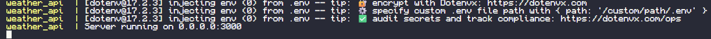
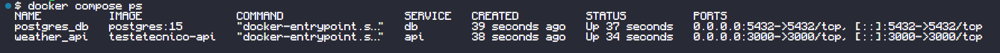
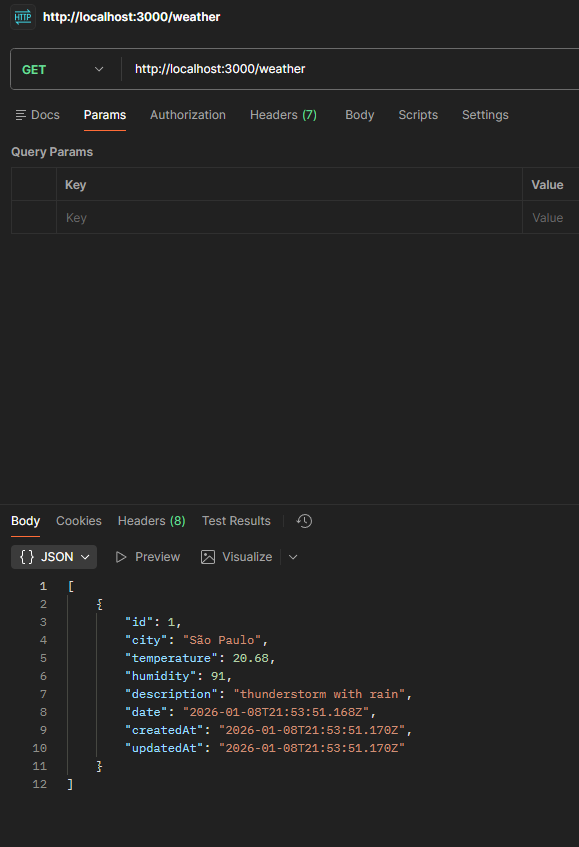
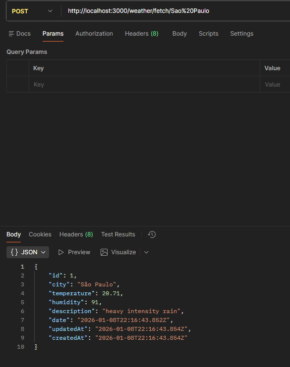

API de clima - Teste Técnico

-Tecnologias usadas:
    Node.js
    Express
    Sequelize
    PostgreSQL
    Docker & Docker Compose
    OpenWeather API

-Funcionalidades implementadas:
    Consumo de dados climáticos a partir da API pública da OpenWeather
    Armazenamento dos dados em banco de dados PostgreSQL
    API REST para:
        Buscar os dados de uma cidade e salvar no banco
        Consultar os dados que foram armazenados
    Ambiente totalmente conteinerizado com Docker

-Estrutura do projeto:
    src/
    ├── api/
    │ └── fetchWeather.js
    ├── db/
    │ └── index.js
    ├── models/
    │ └── WeatherData.js
    ├── routes/
    │ └── weatherRoutes.js
    ├── app.js
    docker-compose.yml
    Dockerfile
    .env.example
    package.json

-Configuração e execução do projeto:
    1° Clone o repositório usando git clone
    2° Crie um arquivo .env na raiz desse projeto com base no arquivo .env.example que coloquei no mesmo
    3° Preencha o arquivo .env com as informações necessárias

    --EXECUÇÃO COM DOCKER--
    4° Com o Docker e o Docker Compose configurados, execute o comando abaixo na raiz do projeto

    docker compose up --build

    Isso vai:
        Construir a imagem da API
        Criar e inicializar o banco de dados PostgreSQL
        Subir a aplicação já conectada ao banco

    Após a inicialização, estará disponível em: http://localhost:3000

    --USO DA API--
    
    Para buscar os dados climáticos de uma cidade e armazena-los no banco, utilize o endpoint:

        POST /weather/fetch/:city 
        (Por exemplo: POST http://localhost:3000/weather/fetch/Sao%20Paulo)

    Para consultar dados armazenados listando os registros salvos no banco de dados, utilize:

        GET /weather
        (Por exemplo: GET http://localhost:3000/weather)

    --BANCO DE DADOS--

    Como mencionado, o projeto utiliza um banco de dados PostgreSQL.
    A estrutura da tabela é criada automaticamente na inicializaçãod a aplicação por meio do Sequelize

    A seguir, os campos armazenados:
        -Cidade
        -Temperatura
        -Umidade
        -Descrição do clima
        -Data da coleta

    --OBSERVAÇÕES--

    As variáveis de ambiente sensíveis NÃO são versionadas no repositório
    O ambiente docker garante que a aplicação possa ser executada de forma reprodutível em qualquer máquina
    
-Demonstração da aplicação:
    Ambiente Docker em execução
    
    Containers ativos
    
    Busca e armazenamento de dados climáticos
    
    Consulta dos dados armazenados
    